# Screenshots

Screenshots of the ConfigGuard prototype (AI-Driven Multi-Vendor Network Security Compliance Auditor), taken from the running application.

## Sign-in and account security

Organization-scoped accounts with password sign-in and TOTP two-factor authentication (with backup codes).

| Sign in | Create organization |
|---|---|
| 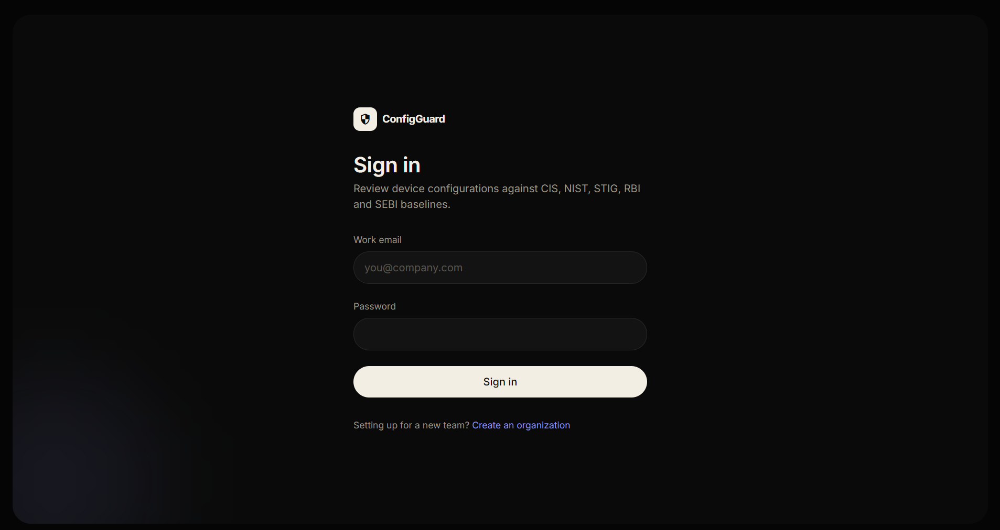 | 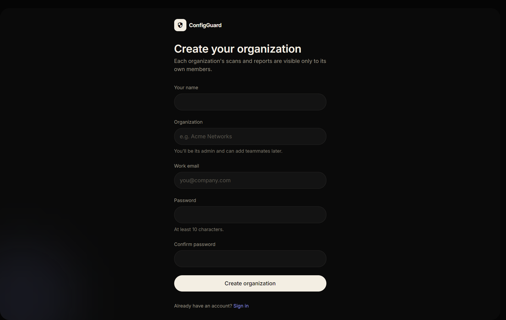 |

| 2FA: authenticator code | 2FA: backup code |
|---|---|
| 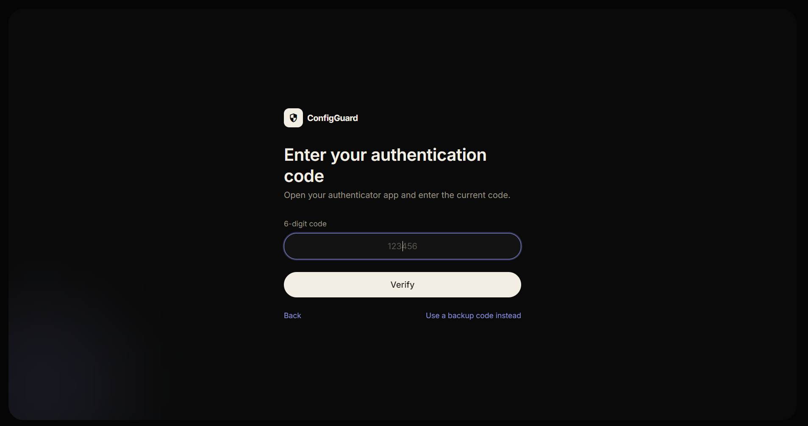 | 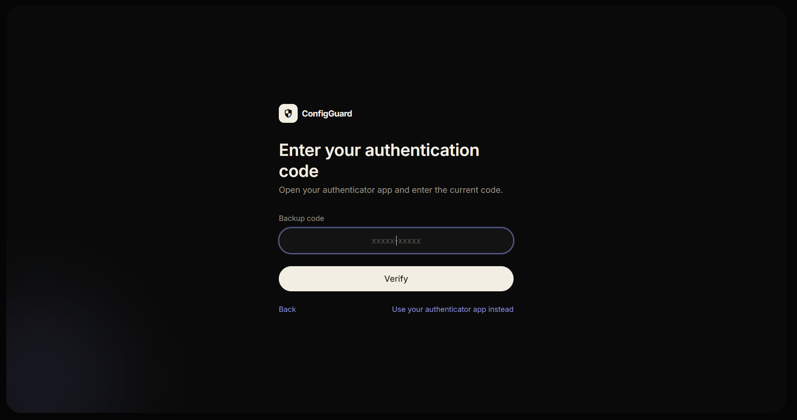 |

## Upload and vendor selection

Upload one or more config files. The vendor can be auto-detected or chosen manually.

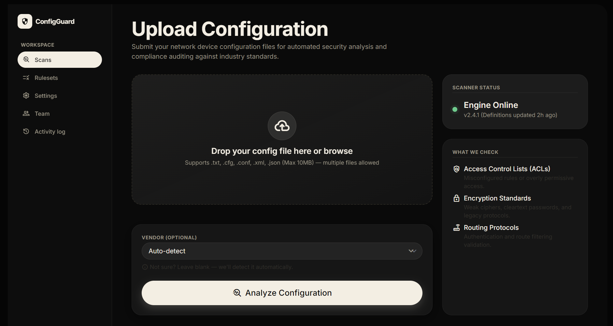

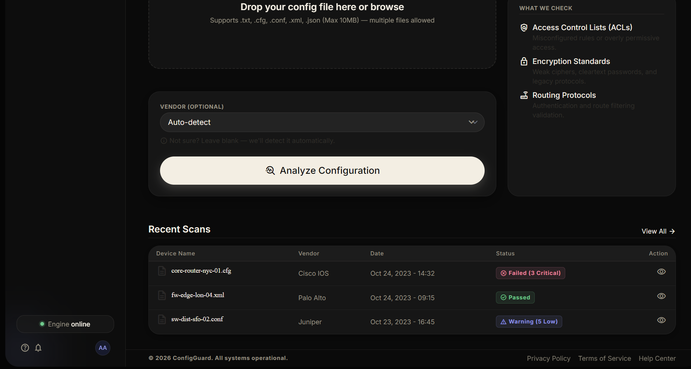

## Compliance report

Pick one or more frameworks (CIS, NIST, STIG, RBI, SEBI, ISO 27001), switch between Simple and Technical view, and export as PDF, JSON, CSV or Markdown.

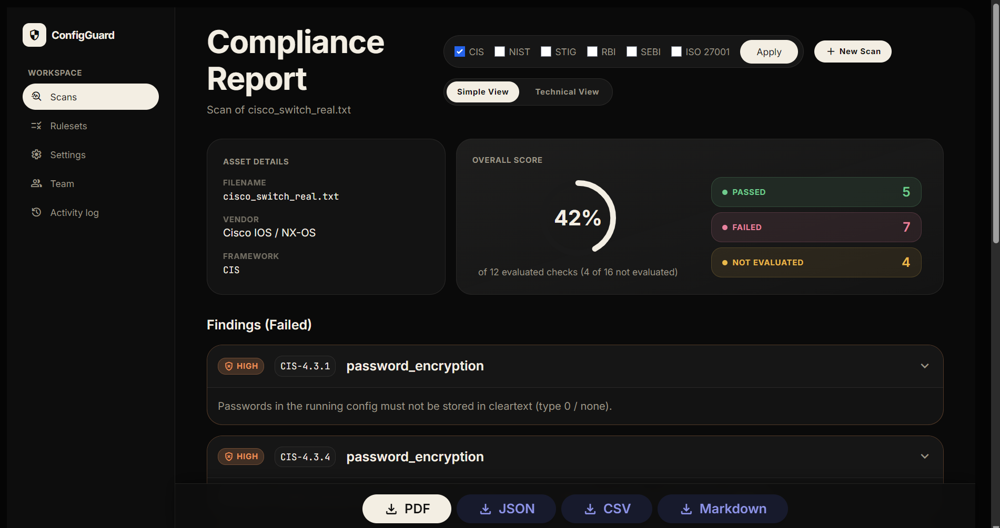

## Rulesets

Reference page listing every framework and the rules inside each.

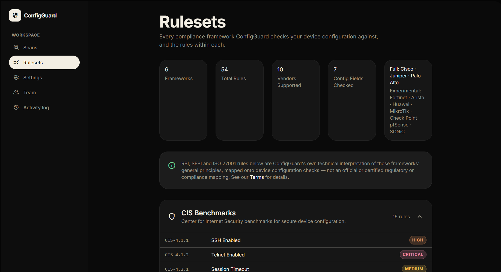

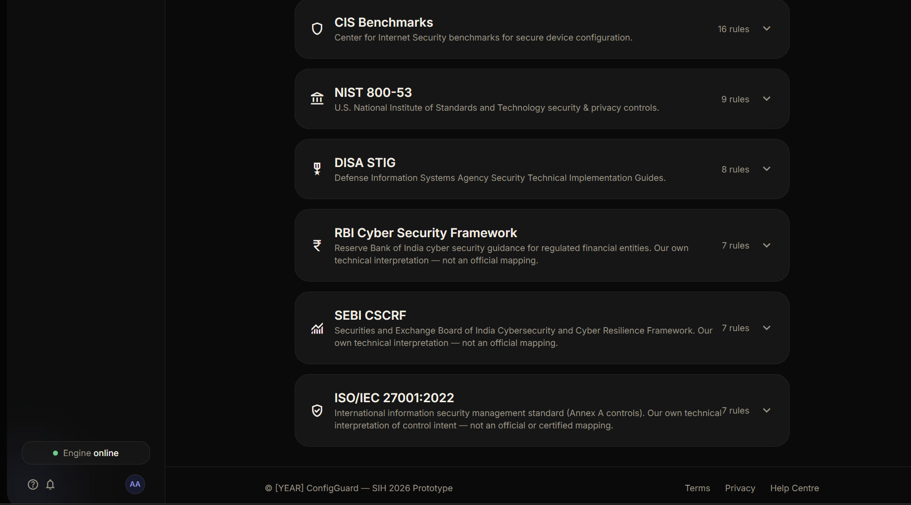

## Administration and audit

Role-based team management and a hash-chained, tamper-evident activity log.

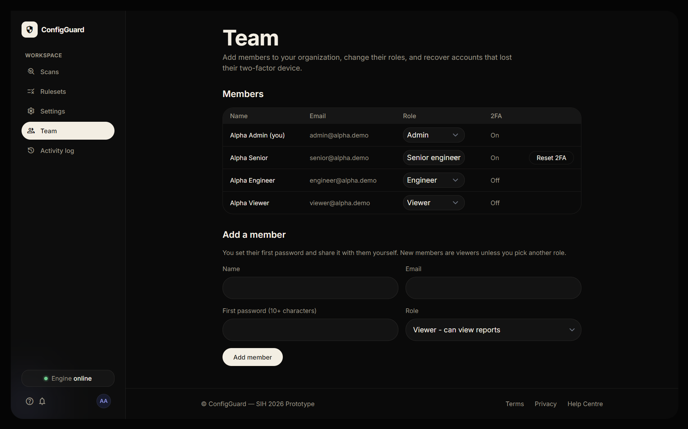

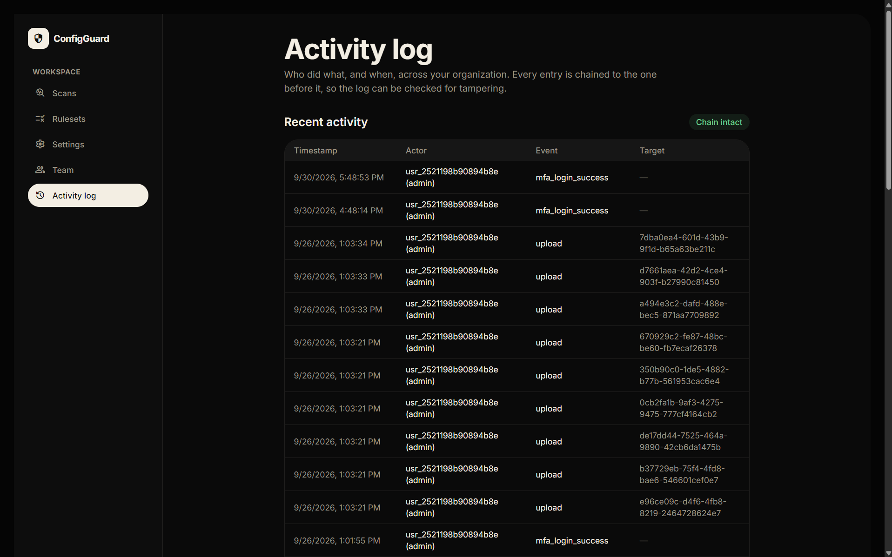

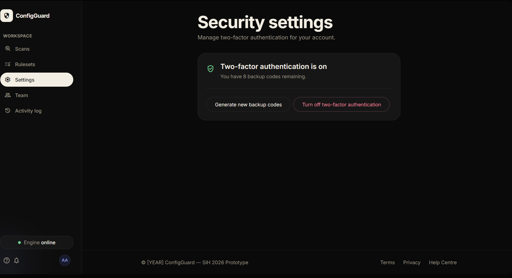

## Help and legal

| Help Centre | Privacy Policy | Terms & Conditions |
|---|---|---|
| 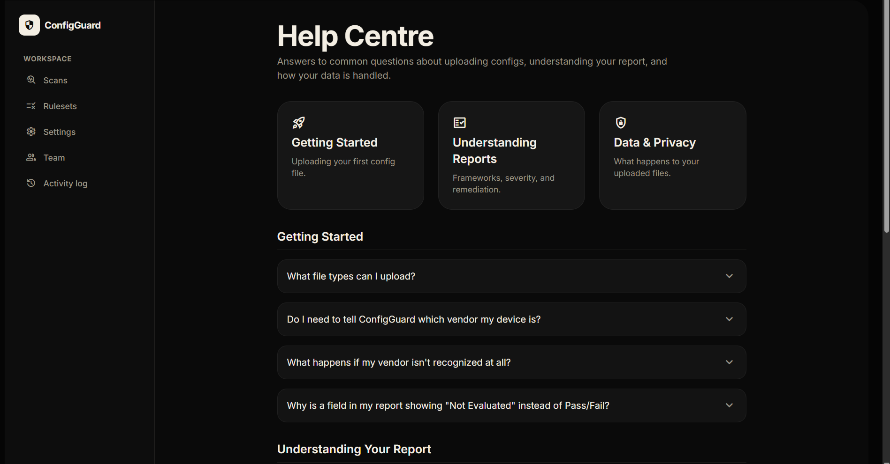 | 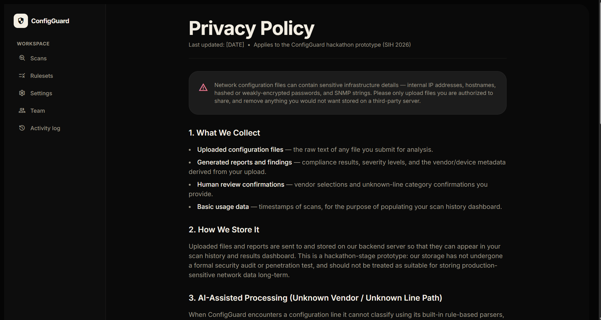 | 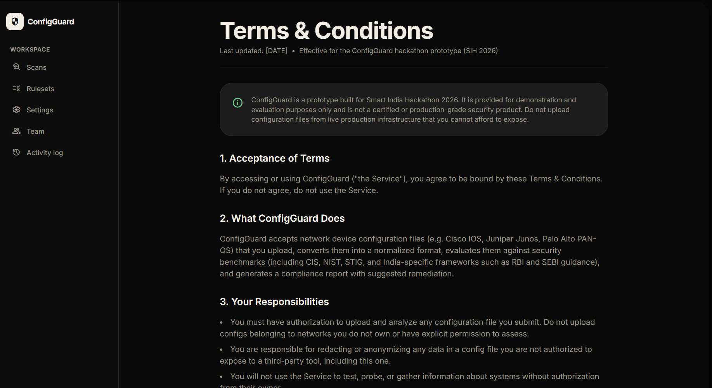 |
